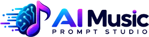

<div align="center">

  <picture>
    <source media="(prefers-color-scheme: dark)" srcset="public/ai-music-dark.webp" />
    
  </picture>

  # 🎵 AI Music Prompt Studio

  **Empower your musical creativity with production-ready prompts for Suno, Udio, Google Music Flow, Mureka, Happy Shrimp, and more.**

  [](https://ai-music.viaweb.pro)
  [](https://github.com/rodrigocaetanooficial/AIMusicPromptGenerator/actions)
  [](https://nextjs.org/)
  [](https://tailwindcss.com/)
  [](https://www.typescriptlang.org/)
  [](https://www.prisma.io/)
  [](LICENSE)

</div>

---

> [!NOTE]
> **Live Web Application:** Access the deployed instance directly at [**https://ai-music.viaweb.pro**](https://ai-music.viaweb.pro)

---

## 🌟 Overview

**AI Music Prompt Studio** is a full-stack, state-of-the-art web application crafted to transform simple music ideas into rich, production-grade prompts for **Suno**, **Udio**, **Google Music Flow**, **Mureka**, **Happy Shrimp**, and other leading AI music composition platforms.

Featuring a multi-provider AI engine, automatic model listing, SQLite persistence with NextAuth, per-model toggle switches, and the **Aurora** design system (warm light + amethyst deep dark themes), it delivers instant, structured prompts categorized into **Rhythm**, **Style**, and **Technical Details**.

---

## 🎵 Compatible AI Music Platforms

The structured prompts generated by this tool are copy-paste ready for the most popular AI music generators:

| Platform | Link |
| :--- | :--- |
| **Suno** | [suno.com](https://suno.com) |
| **Udio** | [udio.com](https://udio.com) |
| **Google Music Flow** | [Google Labs](https://labs.google) |
| **Mureka** | [mureka.ai](https://mureka.ai) |
| **Happy Shrimp** | [happyshrimp.ai](https://happyshrimp.ai) |
| **Riffusion** | [riffusion.com](https://riffusion.com) |
| **Stable Audio** | [stableaudio.com](https://stableaudio.com) |
| **AIVA** | [aiva.ai](https://aiva.ai) |
| **Boomy** | [boomy.com](https://boomy.com) |
| **Soundraw** | [soundraw.io](https://soundraw.io) |
| **Mubert** | [mubert.com](https://mubert.com) |

Each prompt is split into three functional layers — **Rhythm** (BPM, time signature, groove, percussion), **Style** (genre, era, production aesthetic, vocal direction), and **Details** (instrumentation, mixing characteristics, mood modifiers) — so any text-to-music engine can interpret your vision accurately.

---

## ✨ Key Features

- 🎹 **Structured 3-Field Output**:
  - **🥁 Rhythm**: Precise BPM, time signatures, drum patterns, and groove descriptions.
  - **🎨 Style**: Genre, subgenre, era, mood, and atmospheric characteristics (strictly no artist/band names).
  - **🎛️ Technical Details**: Specific instrument tones, arrangement elements, mixing techniques, and vocal dynamics.

- 🤖 **Universal AI Provider Ecosystem (25+ APIs)**:
  - **Google AI (Gemini)**, **Groq**, **OpenRouter**, **OpenAI**, **DeepSeek**, **NVIDIA NIM**, **xAI (Grok)**, **Perplexity**, **Together AI**, **Fireworks AI**, **Mistral**, **Ollama (Local)**, and more.

- ⚡ **Dynamic Model Discovery**:
  - Automatically fetches and populates live models directly from provider endpoints (`/models`).

- 🎚️ **Per-Model Toggle Switches**:
  - Enable or disable specific models per provider to clean up your workspace dropdown.

- 🔐 **Authentication & Permanent Sync**:
  - Sign in with **Google OAuth** or **Email Verification**.
  - Sync provider configurations, API keys, and model preferences permanently to an encrypted SQLite database.

- 🌓 **Aurora Light / Aurora Deep Themes**:
  - Warm, airy light theme with soft aurora glows and an amethyst deep dark mode — Sora display type, WCAG AA contrast, dynamic slider fills, and instant real-time theme toggling.

---

## 🛠️ Tech Stack & Architecture

| Layer | Technology |
| :--- | :--- |
| **Framework** | [Next.js 16 (App Router)](https://nextjs.org/) |
| **Language** | [TypeScript](https://www.typescriptlang.org/) |
| **Styling** | [Tailwind CSS v4](https://tailwindcss.com/) & [shadcn/ui](https://ui.shadcn.com/) |
| **State Management** | [Zustand](https://github.com/pmndrs/zustand) (with LocalStorage & API sync) |
| **Database & ORM** | [Prisma](https://www.prisma.io/) with [SQLite](https://www.sqlite.org/) |
| **Authentication** | [NextAuth.js](https://next-auth.js.org/) (Google OAuth + Credentials Provider) |
| **Icons & Animation** | [Lucide React](https://lucide.dev/) |
| **Deployment** | [OVH Cloud VPS](https://www.ovhcloud.com/) + GitHub Actions + PM2 + Nginx |

---

## 🚀 Getting Started

> [!TIP]
> Make sure you have **Node.js 20+** or **Bun** installed before proceeding.

### 1. Clone the Repository

```bash
git clone https://github.com/rodrigocaetanooficial/AIMusicPromptGenerator.git
cd AIMusicPromptGenerator
```

### 2. Install Dependencies

```bash
npm install
```

### 3. Setup Environment Variables

Create a `.env` file in the project root:

```env
DATABASE_URL="file:./prisma/dev.db"
NEXTAUTH_URL="http://localhost:3000"
NEXTAUTH_SECRET="your-super-secret-key-here"

# Google OAuth Credentials (Optional)
GOOGLE_CLIENT_ID="your-google-client-id"
GOOGLE_CLIENT_SECRET="your-google-client-secret"
```

### 4. Initialize Database Schema

```bash
npx prisma db push
```

### 5. Run the Local Development Server

```bash
npm run dev
```

Open [http://localhost:3000](http://localhost:3000) in your browser to start generating music prompts!

---

## ☁️ Deployment Pipeline

This repository includes a continuous integration and deployment pipeline configured in `.github/workflows/deploy.yml`:

1. **Trigger**: Pushes to `main` branch.
2. **Build**: Standalone Next.js bundle created via GitHub Actions runner.
3. **Deployment**: Automatic SCP release deployment to OVH Cloud VPS running PM2 process manager behind an Nginx reverse proxy.

---

## 📜 License

Distributed under the **MIT License**. See [`LICENSE`](LICENSE) for more information.

---

<div align="center">

  **Developed with ❤️ by [ViaWeb](https://www.viaweb.pro) & [Rodrigo Caetano](https://github.com/rodrigocaetanooficial)**

  [www.viaweb.pro](https://www.viaweb.pro)

</div>
